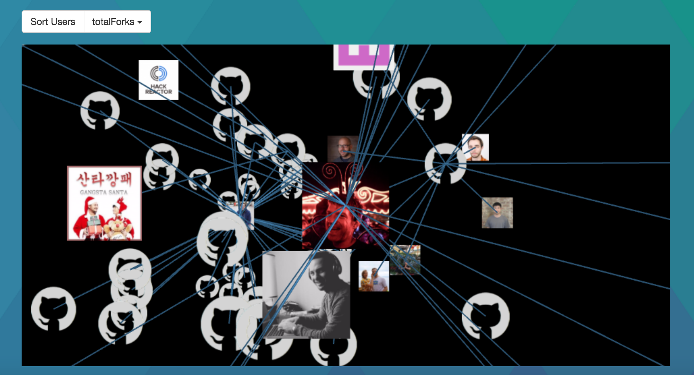
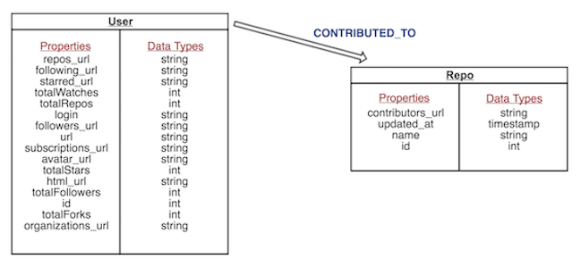

# GitNet
* Visualization of Github Network by Contribution to Repositories
* Deployed Link: [http://192.241.226.71:44100/](http://192.241.226.71:44100/)

  * Explore your Github network by contribution to repositories.
    

## Getting Started on Localhost

### Development

#### Get the code
* Fork and clone this repo
* Run `npm install`

#### Set up Github OAuth

* Create a [Github Developer Application](https://github.com/settings/developers)
  * Use `http://localhost:3000` for the Homepage URL
  * Use `http://localhost:3000/auth/github/callback` for the Authorization Callback URL

  * Add the `GITHUB_CLIENT_ID` and `GITHUB_CLIENT_SECRET` you receive for your application to environment variables as `CLIENT_ID` and `CLIENT_SECRET`.

      * Copy the content from file `config_example.js`
      * Create a new folder called `config`
      * Create a new file called `config.js` inside the folder `config`
      * Paste the content from `config_example.js` to `config.js`
      * Define properties `CLIENT_ID` and `CLIENT_SECRET`

#### Set up Session Secret
  * Set `SESSION_SECRET` in `config/config.js` to 'asdghfwutry'

#### Start up neo4j
  * Start neo4j server on `localhost`
  * Define `DB_USERNAME` and `DB_PASSWORD` in `config/config.js`

#### Start the App
* Run `npm run build`
* Run `npm start`
* Browse to [http://localhost:3000](http://localhost:3000)

## Architecture

## Schema

## Test
* Make sure you have already run `npm start` and started up neo4j server on `localhost`
* Run `npm run serve`
* Run `npm test`
  * Note: All test files are located in `/test/spec/`.

## Deployment
* See [deployment.md](docs/deployment.md) for how to deploy using Docker.

## Team
* [Andy Tran](https://github.com/adtran117)
* [Mario Yeung](https://github.com/marioyeung)
* [Michael Daly](https://github.com/michael-daly)

